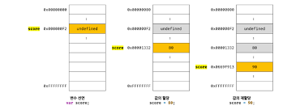

# 4장. 변수 정리본

## 메모리(Memory)

메모리는 데이터를 저장할 수 있는 **메모리 셀의 집합체**이다.


메모리 셀 하나의 크기는 1바이트(8비트)이고, 즉 1바이트 단위로 데이터를 저장(write)하거나 읽어온다(read)<br>
=> 모든 데이터 값은 **2진수로 저장**된다!

만약, 10 + 20 이라는 연산을 수행하면 메모리에는 CPU가 연산해서 만들어낸 30이라는 값이 저장된다.<br>

이를 다시 재사용하고 싶을 때는 메모리 공간에 접근을 해서 가져와야 하는데 **메모리 주소를 통해 값에 직접 접근하는 것은 치명적 오류를 발생시킬 가능성**이 높다.

그렇기에, 자바스크립트도 개발자의 직접적인 메모리 제어를 허용하지 않는다.

프로그래밍 언어는 **기억하고 싶은 값을 메모리에 저장하고, 저장된 값을 읽어 들여 재사용**하기 위해 `변수`라는 메커니즘을 제공한다.

---

## 변수(Variable)

`변수`는 **하나의 값을 저장하기 위해 확보한 메모리 공간** 자체 또는 그 메모리 공간을 **식별하기 위해 붙인 이름**을 말한다.

변수 이름은 곧 **메모리 공간의 주소로 치환**되어 실행되는 것이다.


**변수에 값을 저장**하는 것을 **할당**, **변수의 값을 읽어 들이는 것**을 **참조**라고 함.

**<자바스크립트 엔진 관점>**<br>

1. 변수 이름을 통한 참조 요청
2. 변수 이름과 매핑된 메모리 주소 확인
3. 해당 메모리 공간에 접근 후 저장된 값 반환

> **식별자(Identifier)** <br>
> 식별자는 어떤 값을 구별해서 식별할 수 있는 고유한 이름을 말한다.
> 변수이름도 식별자 중 하나이다. (함수, 클래스 등의 이름 모두 마찬가지)

## 변수 선언과 호이스팅

**변수 선언**이란 **변수를 생성**하는 것<br>
=> 값을 저장할 메모리 공간 확보<br>
=> 변수이름과 메모리 공간 주소 연결

변수를 사용하려면 **반드시 선언이 필요**하다.

변수 선언 키워드는 var, **let**, **const**가 있다.

변수 선언에 의해 확보된 메모리 공간은 **자바스크립트 엔진에 의해 undefined 값이 암묵적으로 할당**되어 초기화된다.

**<변수 선언, 자바스크립트 엔진 관점>**<br>

1. `선언 단계`<br>변수 이름 등록 -> JS엔진에 변수의 존재를 알림
2. `초기화 단계`<br>
   값을 저장하기 위한 메모리 공간을 확보 & undefined 할당

### 변수 선언의 실행시점과 변수 호이스팅

```javascript
console.log(abc); //undefined
var abc;
```

코드상 변수 선언보다 변수 참조가 더 앞에 있어서 참조 오류가 발생할 것으로 예상되지만, 그렇지 않다.

그 이유는, 변수 선언이 소스코드가 한 줄씩 순차적으로 실행되는 시점, 즉 **런타임이 아니라 그 이전 단계에서 먼저 실행되기 때문**이다.

자바스크립트 엔진은 소스 코드를 순차적으로 실행하기 전에, 소스 코드에서 선언문을 다 꺼내서 먼저 실행한다.

이처럼, **변수 선언문이 코드 맨 앞으로 올라간 것처럼 동작**하는 **자바스크립트 고유의 특징**을 `변수 호이스팅`이라 한다.

```javascript
//변수 선언, 값 할당 따로
var score;
score = 80;

//한 번에 같이
var score = 80;
```

자바스크립트에서는 변수 선언과 할당 코드를 한 번에 작성하든 2개로 나눠서 작성하든 항상 2개로 나누어서 실행한다.

이때, 선언과 할당의 실행 시점이 다르다는 점이 중요하다.<br>
**선언은 런타임 이전, 할당은 런타임에 실행된다.**

## 값의 재할당

`var키워드`와 `let키워드`로 변수를 선언하면 **변수 값의 재할당이 가능**하다.

재할당이라는 것은 기존의 메모리 공간에 새로운 값을 저장하는 것이 아니라,**새로운 메모리 공간을 파서 거기에 값을 저장하고 변수가 참조하는 공간을 변경**하는 것이다.



재할당으로 인해 필요없어진 이전 값(누구도 참조하지 않는 값)은 **가비지 콜렉터에 의해 메모리에서 자동 해제**된다.(단, 언제 해제될지는 예측 불가하다)

## 네이밍 컨벤션

`네이밍 컨벤션`은 하나 이상의 영어 단어로 구성된 식별자를 만들 때 **가독성 좋게 단어를 한눈에 구분하기 위해 규정한 명명 규칙**이다.

- 카멜 케이스 : firstName

- 스네이크 케이스 : first_name

- 파스칼 케이스 : FirstName

자바스크립트에서는 일반적으로 **변수나 함수의 이름**에는 `카멜 케이스`를 사용하고 **생성자 함수, 클래스의 이름**에는 `파스칼 케이스`를 사용한다.

# 5장. 표현식과 문 정리

컴퓨터 공학 전반에서 자주 사용하는 용어의 개념을 정확하게 이해하는 것이 목적임.

## 값(Value)

값은 **식이 평가되어 생성된 결과**를 말한다.<br>
평가란 식을 해석해서 값을 생성하거나 참조하는 것을 의미한다.

```javascript
//sum이라는 변수에 10+20이 평가되어 생성된 숫자 값 30이 할당된다.
var sum = 10 + 20;
```

## 리터럴(Literal)

리터럴은 **사람이 이해할 수 있는 문자 또는 약속된 기호를 사용해 값을 생성하는 표기법**을 말한다.

```javascript
//숫자 리터럴 3
3;
```

## 표현식(Expression)

표현식은 값으로 평가될 수 있는 문(statement)이다.
즉, 표현식이 평가되면 새로운 값 생성 또는 기존 값을 참조한다. (리터럴도 값으로 평가되므로 표현식)

## 문(Statement)과 표현식(Expression)

문은 프로그램을 구성하는 기본 단위이자 최소 실행 단위다.<br>
선언문, 할당문, 조건문, 반복문 등으로 구분된다.<br>
문은 여러 **토큰(Token)**으로 구성된다.<br>
토큰은 문법적인 의미를 가지며, 문법적으로 더 이상 나눌 수 없는 코드의 기본요소를 말한다.(키워드,식별저,세미콜론 등)

## 세미콜론과 세미콜론 자동 삽입 기능

세미콜론(;)은 문의 종료를 나타낸다.<br>
따라서, 문의 끝에는 세미콜론을 붙여야 한다.<br>
단, 0개 이상의 문을 **중괄호로 묶고 있는 코드 블록 뒤에는 세미콜론(;)을 붙이지 않는다**.(for문, if문, 함수 등)<br>
이러한 코드 블록은 언제나 문의 종료를 의미하는 **자체 종결성**을 갖기 때문이다.

문의 끝에 붙이는 세미콜론도 옵션이다. (생략 가능)<br>
자바스크립트 엔진에서 문의 끝이라고 예측되는 지점에 세미콜론을 자동으로 붙여주는 **세미콜론 자동 삽입 기능(ASI)**이 암묵적으로 수행되기 때문이다.<br>
그러나, 개발자 의도와 다르게 동작할 수 있기 때문에 붙이는 습관이 좋다.
